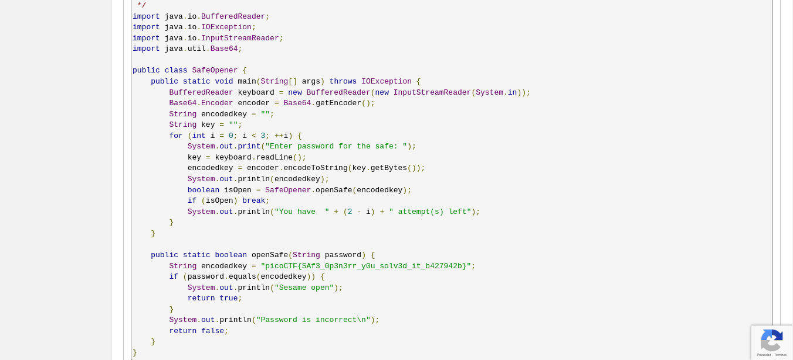

# Safe Opener 2

## Objetivo

What can you do with this file?
I forgot the key to my safe but this [file](https://artifacts.picoctf.net/c/287/SafeOpener.class) is supposed to help me with retrieving the lost key. Can you help me unlock my safe?

## Solución

Se descarga el archivo, y se observa que es un archivo compilado *.class*
Con ayuda de un decompilador java se hace lo siguiente.

Se sube el archivo

Al terminar el proceso se observa la clase original junto con la llave escondida

Bandera: picoCTF{SAf3_0p3n3rr_y0u_solv3d_it_b427942b}

## Referencias

[Decompilador online de java](http://www.javadecompilers.com/result)
